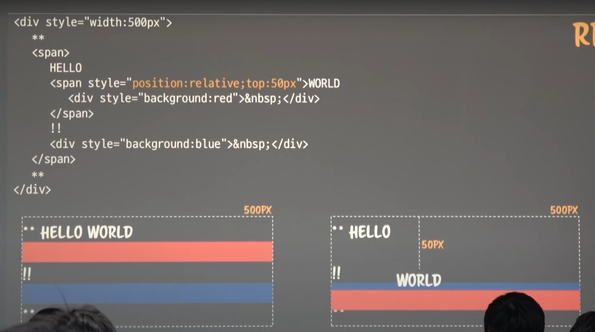

# Normal Flow 

- CSS Rendering 1회차
---

## CSS 2.1 Visual Formatting Model

- positioning schemes & normal flow

[Visual formatting model](https://www.w3.org/TR/CSS2/visuren.html)

## Position

- geometry 영역에 추상적인 위치를 결정해주는 것
- static, relative, absolute, fixed, inherit
- position이 `static`, `relative`일 경우에만 normal flow에 들어간다.
- html 모든 값은 position이 기본적으로 static이다.

## Normal Flow

- block formatting context (BFC)
- inline formatting context (IFC)
- relative formatting context
    - normal flow의 일부이지만, position에서 정의하고 있음.

## BFC

- block : 부모 만큼 가로 길이를 다 차지하는 것.
    - 자식의 x 값은 항상 0, width는 부모의 width, y 값은 상위 자식(들)의 height의 합
    - 자식의 height의 합이 부모의 height

## IFC

- 나의 contents 길이만큼이 가로 길이
- 다음번 요소의 x는 이전 요소(들)의 width
- inline 요소의 width의 합이 부모의 width를 넘어가면, 다음줄로 넘어간다.
- 다음줄 첫번째 요소의 x는 0. y는 윗줄의 요소들 중 가장 height가 큰 값.

### 예제

- width가 500이라는 것은 fragment가 500인 것이고, 실제로는 가로 전체를 차지.
- 따라서 파란 영역은 부모의 가로 길이를 받아서 가로 전체가 채워짐.

 

- 렌더링 시스템과 DOM의 구조는 무관하다.
- DOM의 포함관계와는 무관하게, 렌더링 시스템에게는 BFC, IFC로만 보이게 된다.

- normal flow로 static하게 그린 다음, relative로 50px을 내려서 WORLD, div가 위치함.
- static과 relative가 같이 있으면, relative가 static 위로 뜨게 된다.
- static으로 geometry를 그리고, 그림만 relative하게 그리므로, relative가 geometry를 변경시키지 않는다.